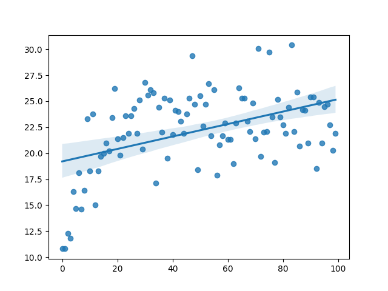

# Genetic Ant

This is a simple implementation of a genetic algorithm to solve the problem of finding food on square board. Ant is placed on the board, and it has to find the food. At the beginning, the ant is given a balance of 10 steps, at each step the balance decreases by 1. Each food found gives +3 to balance, each new cell visited by an ant gives +0.5 to balance. If an ant is stuck in a cell, it begins to lose 2 points per turn. In each population there are 50,000 ants, from which the 2 best are selected. After which they produce a new population using mutations and crossover.
## Evolution of population for 100 epochs
